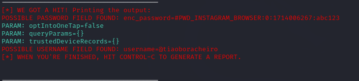

# cibersecurity_desafio_phishing
Repositório criado para o desafio do Bootcamp Santander CiberSecurity DIO.

# Funcionalidade: Capturar Usuário e Senha de login.

Ferramentas
* Virtualbox
* Kali Linux
* Setoolkit

# Configurando o Phishing no Kali Linux
* Acesso root: ```sudo su```
* Iniciando o Setoolkit: ```setoolkit```
* Tipo de ataque: ```Social engineering attacks```
* Vetor do ataque: ```web site attack vectors```
* Método de ataque: ```credential harvester attack method```
* Método de ataque: ```site cloner```
* Obter endereço da máquina: ```ifconfig```
* URL para clonagem: http://www.instagram.com

# Resultado:

  

